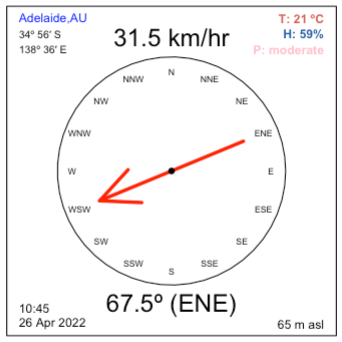

# Anemometer function in R

A handy function to create a simple anemometer plot for anywhere in the world in R. 

## Installation & Set-up
1. Install <code>ansiweather</code> in the command line (Terminal) via any one of following: OpenBSD, NetBSD, FreeBSD, Debian, Ubuntu, Homebrew. I use Homebrew on my Mac via: $ <code>brew install ansiweather</code>

<code>ansiweather</code> fetches weather data from <a href="https://openweather.org">OpenWeatherMap</a>'s free API

Access <code>ansiweather</code>'s <a href="https://github.com/fcambus/ansiweather">manual</a> for more information

2. Install the following libraries in R:
- <code>jsonlite</code>
- <code>processx</code>
- <code>lutz</code>
- <code>lubridate</code>

You can do this easily with the following command:
> <code>install.packages(c("jsonlite", "processx", "lutz", "lubridate"))</code>

3. Pre-load the city file, which is the location JSON database <code>ansiweather</code> uses to identify place names. You could add this to the function itself, but it slows processing down considerably, so it's best to load before running function.

> <code>cityfile <- jsonlite::fromJSON(gzcon(url("https://bulk.openweathermap.org/sample/city.list.json.gz")))</code>
  
The 2-digit ISO country code can be found <a href="https://www.statdns.com/cctlds/">here</a>, and you can access various versions and scales of the source JSON database <a href=": https://www.statdns.com/cctlds/">here</a>.

4. Simply run the function script <code>AnemometerFunction.R</code> in R, then you're ready to plot a real-time anemometer (including windspeed, wind direction temperature, date, and time as in the example plot above). Some examples:

> <code>windDir.func("Adelaide,AU")</code> 
> <code>windDir.func("Darlington,AU")</code> 
> <code>windDir.func("Perth,AU")</code> 
> <code>windDir.func("Helsinki,FI")</code> 
> <code>windDir.func("Wellington,NZ")</code> 
> <code>windDir.func("Vancouver,CA")</code> 
> <code>windDir.func("Ushuaia,AR")</code> 
